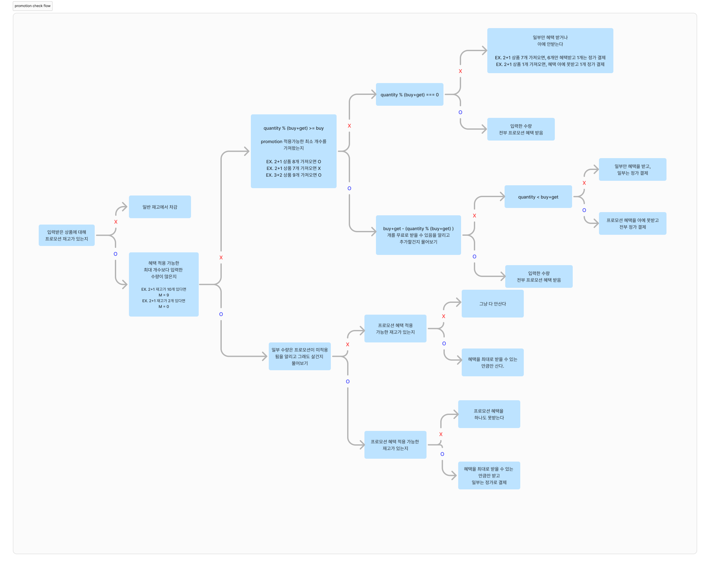

# javascript-convenience-store-precourse

## ✏️ 1. 기능 요구사항

- **예외사항**에 대해서는 ❌ 표시를 하였음

1.  환영 인사와 함께 상품명, 가격, 프로모션 이름, 재고를 안내한다. 만약 재고가 0개라면 '재고 없음'을 출력한다.

        출력 예시)

        안녕하세요. W편의점입니다.
        현재 보유하고 있는 상품입니다.

        - 콜라 1,000원 10개 탄산2+1
        - 콜라 1,000원 10개
        - 사이다 1,000원 8개 탄산2+1
        - 사이다 1,000원 7개
        - 오렌지주스 1,800원 9개 MD추천상품
        - 오렌지주스 1,800원 재고 없음
        - 탄산수 1,200원 5개 탄산2+1
        - 탄산수 1,200원 재고 없음
        - 물 500원 10개
        - 비타민워터 1,500원 6개
        - 감자칩 1,500원 5개 반짝할인
        - 감자칩 1,500원 5개
        - 초코바 1,200원 5개 MD추천상품
        - 초코바 1,200원 5개
        - 에너지바 2,000원 5개
        - 정식도시락 6,400원 8개
        - 컵라면 1,700원 1개 MD추천상품
        - 컵라면 1,700원 10개

        구매하실 상품명과 수량을 입력해 주세요. (예: [사이다-2],[감자칩-1])

    - public/products.md과 public/promotions.md 파일을 이용한다.
    - promotion이 붙어있더라도 promotion 기간에 해당이 안된다면 일반 재고에 합쳐서 보여지도록 한다.

2.  구매할 상품과 수량을 입력받는다

        입력 예시)

        [콜라-10],[사이다-3]

    - 구매할 상품과 수량을 입력 받는다.
    - 상품명, 수량은 하이픈(-)으로, 개별 상품은 대괄호([])로 묶어 쉼표(,)로 구분한다.

    ❌ 구매할 상품과 수량 형식이 올바르지 않은 경우

         ⭕ 너그럽게 대괄호 안에서의 공백은 인정해주기로 하였음
            즉, ","로 이어진 상품과 상품에 공백이 없어야함
            [감자칩 -  1],[콜라 -1   ]

         [감자칩-1], [콜라-1]
         [감자칩-a]

    ❌ 존재하지 않는 상품을 입력한 경우

         [맥콜-1]

    ❌ 구매 수량이 재고 수량을 초과한 경우

         [콜라-1000]

3.  프로모션 적용 가능한 상품에 대해 고객이 해당 수량보다 적게 가져온 경우, 그 수량만큼 추가 여부를 입력받는다. (혜택 알림에 관해서 자세한 내용은 생각해볼 요소 3번에 정리해놓았음)

        출력 예시)

        현재 {상품명}은(는) 1개를 무료로 더 받을 수 있습니다. 추가하시겠습니까? (Y/N)

    - Y: 증정 받을 수 있는 상품을 추가한다.
    - N: 증정 받을 수 있는 상품을 추가하지 않는다.

    ❌ 재고도 있고 promotion도 적용할 수 있는데 안가져오면 멤버십 할인을 받을 수 있다.

         EX) 2+1 promotion 중인 재고가 3개이고 나는 2개만 구매하려 할 때, promotion이 미적용되므로 멤버십 할인을 받을 수 있다.

4.  프로모션 재고가 부족하여 일부 수량을 프로모션 혜택 없이 결제해야 하는 경우, 일부 수량에 대해 정가로 결제할지 여부를 입력받는다.

        출력 예시)

        현재 {상품명} {수량}개는 프로모션 할인이 적용되지 않습니다. 그래도 구매하시겠습니까? (Y/N)

    - Y: 일부 수량에 대해 정가로 결제한다.
    - N: 정가로 결제해야하는 수량만큼 제외한 후 결제를 진행한다.

    ❌ 2+1 인 상품에 대해서 재고가 2개뿐이면 프로모션 혜택을 못받으므로 멤버십 할인을 받을 수 있다.  
    ❌ 1+1 인 상품에 대해서 재고가 2개뿐이고, 3개를 구매할 때, 2개는 1+1으로 프로모션 혜택을 받고 1개는 프로모션 혜택을 받지 못하므로 1개에 대해서만 멤버십 할인을 받을 수 있다.

5.  멤버십 할인 적용 여부를 입력 받는다.

        출력 예시)

        멤버십 할인을 받으시겠습니까? (Y/N)

    - Y: 멤버십 할인을 적용한다.
    - N: 멤버십 할인을 적용하지 않는다.

    ❌ 4, 5번의 예외에서 설명했듯이, promotion 적용이 안된 상품에 한해서 멤버십 할인 적용 가능

6.  구매 상품 내역, 증정 상품 내역, 금액 정보를 출력한다.

        출력 예시)

        ===========W 편의점=============
        상품명		수량	금액
        콜라         3       3,000
        에너지바     5       10,000
        ===========증 정=============
        콜라        1
        ==============================
        총구매액    8        13,000
        행사할인             -1,000
        멤버십할인           -3,000
        내실돈                9,000

7.  추가 구매 여부를 입력 받는다.

        출력 예시)

        감사합니다. 구매하고 싶은 다른 상품이 있나요? (Y/N)

    - Y: 재고가 업데이트된 상품 목록을 확인 후 추가로 구매를 진행한다.
      - 추가로 구매를 진행할 경우 재고를 차감하여 수량을 관리한다.
    - N: 구매를 종료한다.

## 🚨 2. 추가된 프로그래밍 요구 사항

    1. 메서드의 길이가 10라인을 넘어가지 않도록 구현한다.
    2. 입출력을 담당하는 클래스를 별도로 구현한다.

## 🧐 3. 생각해볼 요소

    1. 기능 요구 사항의 재고관리 에서 '재고를 차감함으로써 시스템은 최신 재고 상태를 유지' 한다는 말이 public/products.md 를 수정해야 한다는 말인건지?
      - 어플리케이션이 동작하는 동안 데이터 변경이 이루어지고 직접적인 파일 변경은 없게끔 하였음. 즉, 물건을 구매하고 프로그램이 종료가 되더라도 products.md는 변경이 없음.

    2. promotion 기간이 종료된다면 일반 재고에 합쳐서 사용자에게 보여줘야 하는건지?
      - 기존 재고가 있다면, 기존 재고와 합쳐서 보여줌

        예시)
        > 콜라 1,000원 10개 탄산2+1
        > 콜라 1,000원 10개
         로 보여지던 것을

        > 콜라 1,000원 20개
         처럼 보여지게 하였음

    3. 2+1 상품에 대해서 1개만 가져왔을 때 1개 더 가져오면 혜택을 받을 수 있음을 알려야 하는건지?
      - 출력예시에서 '프로모션 적용이 가능한 상품에 대해 고객이 해당 수량만큼 가져오지 않았을 경우' 라고 헸으므로 promotion 적용에 필요한 개수만큼 가져와야 혜택 알림을 하도록 하였음. 혜택 알림을 받을 수 있는 경우는 다음과 같다.

        - n은 자연수
        - 2+1 상품에 대해서 3(n-1)+2 만큼 가져왔을 때
        - 1+1 상품에 대해서 2(n-1)+1 만큼 가져왔을 때

    4. [초코바-5],[초코바-5],[초코바-5],[초코바-5] 처럼 같은 상품을 계속해서 입력하면 매 순간 개수 차감에서 구매 가능 여부를 파악해야 하는건지?
      - 우선 중복된 상품명을 입력한다면 ERROR를 반환하고 다시 입력하게끔 하였음.

## 📋 4. Promotion check flow

